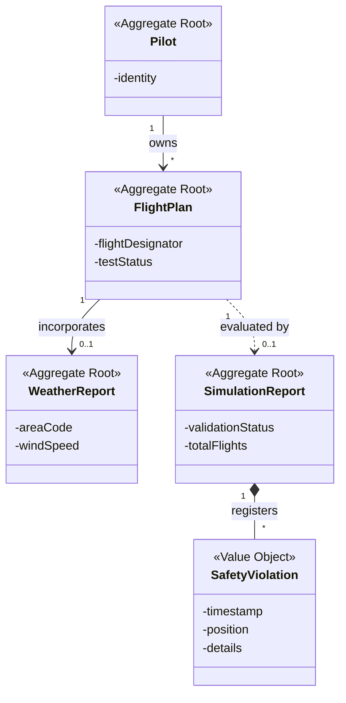

# AISafe - Air Traffic Control Simulator

**Academic Context:** 4th Semester Integrative Project (LAPR4 - BSc Software Engineering, ISEP). Developed in a team of 4 students.

***Note:** The source code is held in a private repository due to the institution's academic integrity policies. This repository documents the architecture and the technical solution developed.*

---

### The Business Problem
Development of an air traffic control simulator requiring seamless integration between a high-level enterprise application and a low-level, high-performance execution engine. The system parses custom flight plans, manages real-time meteorological conditions, and simulates concurrent flight trajectories to detect and prevent safety violations (collisions) in real-time.

### Tech Stack
*   **Enterprise Backend:** Java 21, Maven, Domain-Driven Design (DDD)
*   **Networking:** Custom TCP Server/Client architecture for remote pilot access
*   **Language Processing:** ANTLR4 (Lexer, Parser, Semantic Validation)
*   **Simulation Engine:** C, POSIX standard (Processes, Threads, Shared Memory, Pipes, Semaphores, Mutexes)

### Technical Solution & Architecture
The project bridges two distinct architectural paradigms:

*   **Custom DSL Compiler:** Built an ANTLR4-based parser from scratch to ingest, validate (lexically, syntactically, and semantically), and translate a custom Domain Specific Language into Java Domain Objects.
*   **Remote Access Architecture:** Implemented a multi-threaded TCP server with strict authentication and role-based access control, allowing remote Pilots and Operators to interface with the domain logic without direct database access.
*   **High-Concurrency Engine:** Engineered a C-based simulation engine utilizing `fork()` for individual flight lifecycle management, unnamed `pipe()` for Inter-Process Communication (IPC), and POSIX Semaphores for strict lockstep step-by-step synchronization.
*   **Real-Time Safety Threading:** Utilized `pthread` and Shared Memory (`shmget`), protected by Mutexes, to isolate the collision detection logic into a dedicated thread, ensuring zero bottlenecking on the main orchestrator process.

### Domain Model (DDD Excerpt)

### Team
Developed in collaboration with Diogo Silva, Gonçalo Tavares and João Ferreira.
